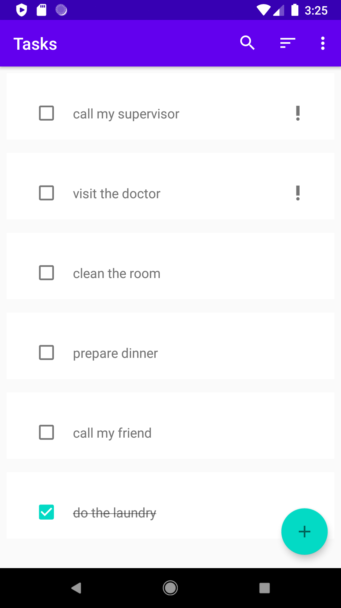
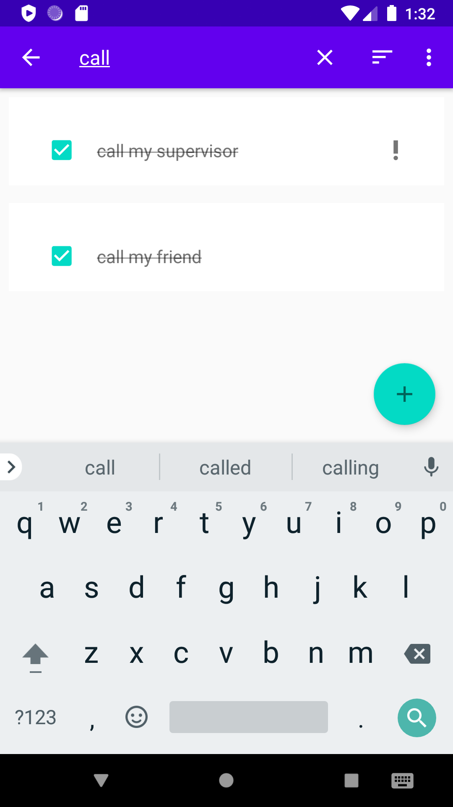
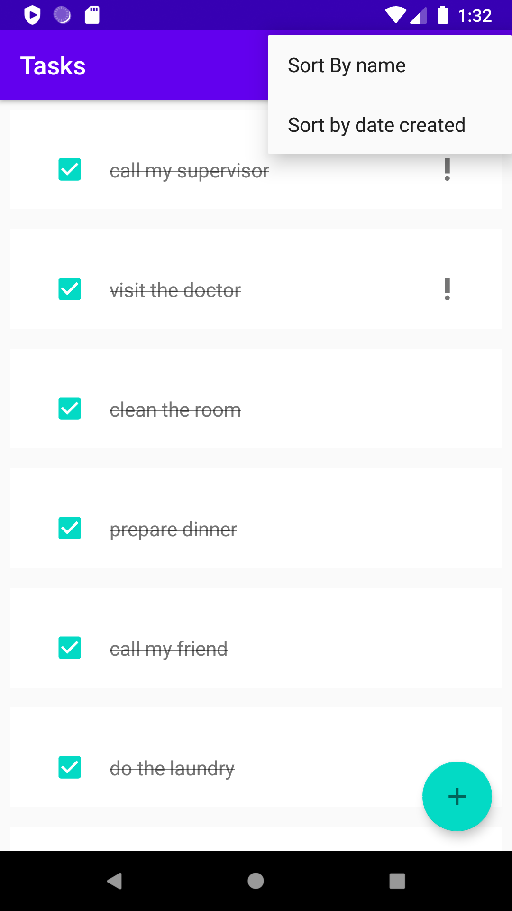
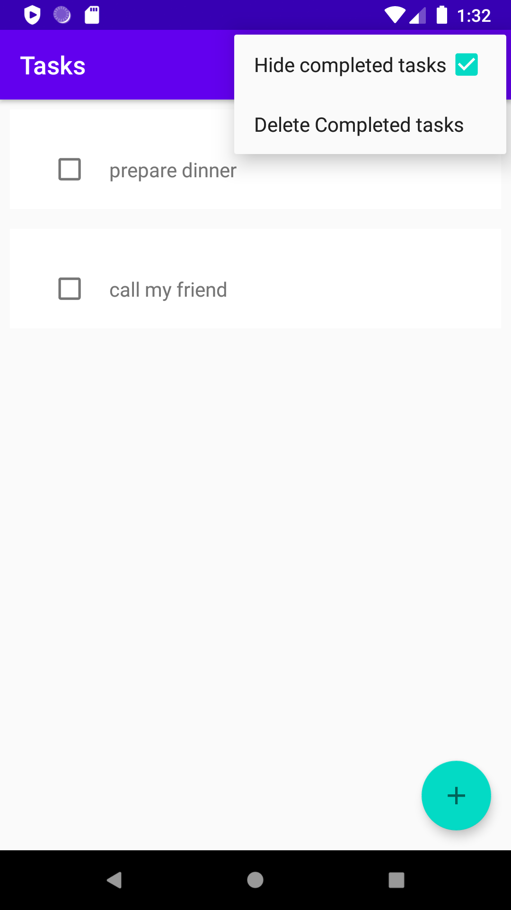
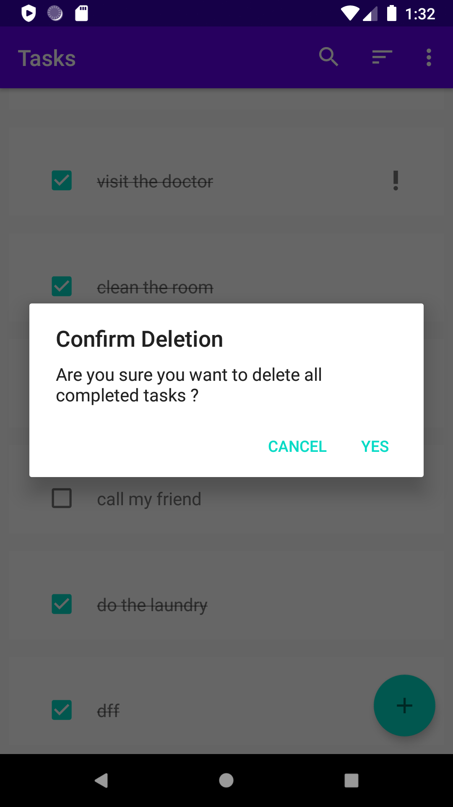
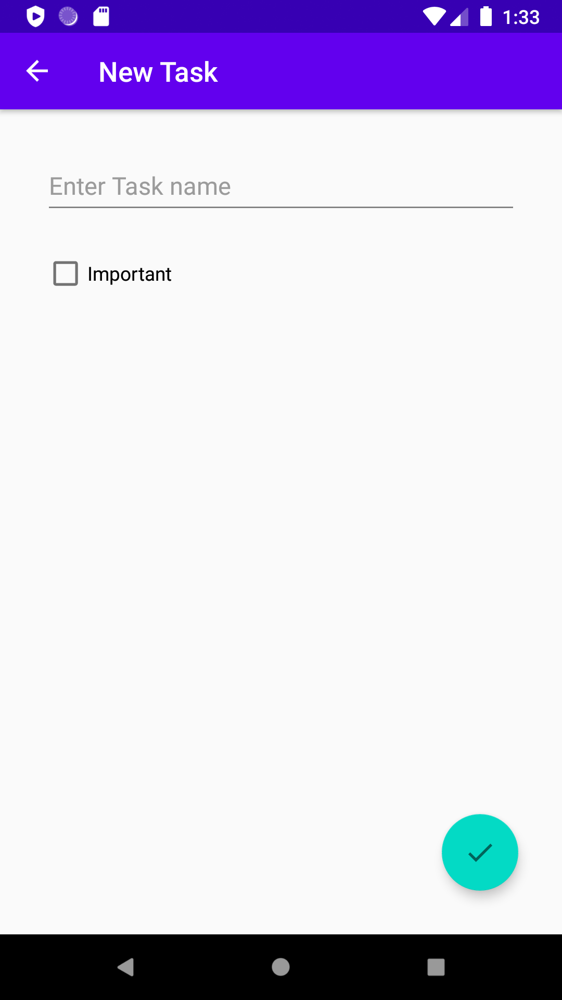
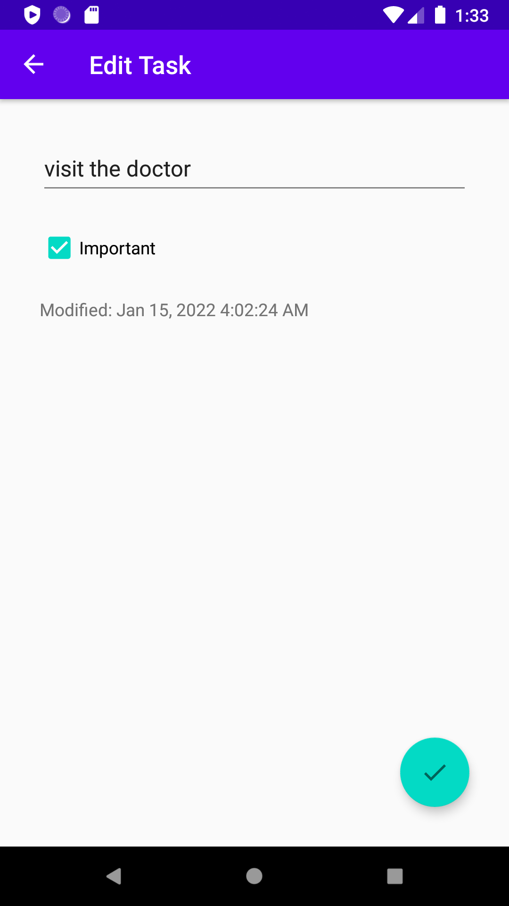
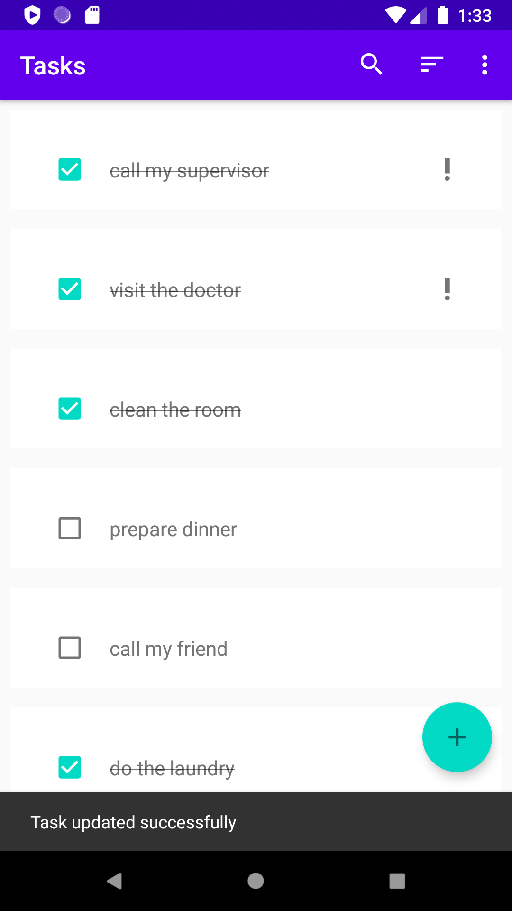
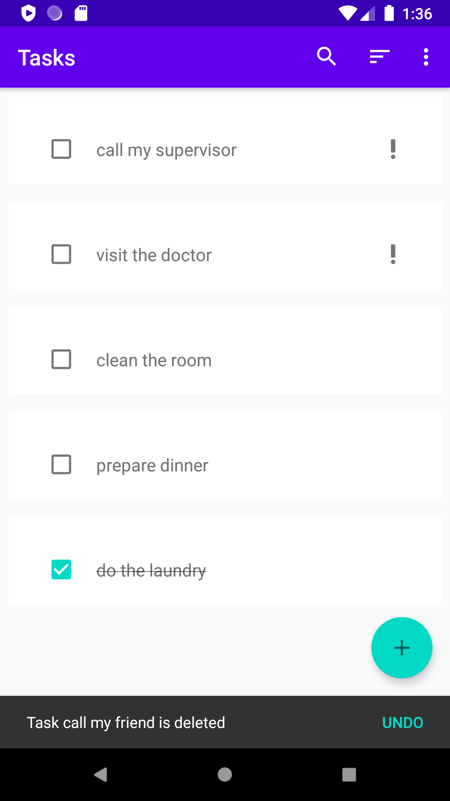

# TaskHive
Task-Hive is Android To-do list app 

## The app works as follow :
1.	The main screen which displays the user saved tasks in room offline sqlite database as recyclerview with each task name and checkbox to represent task status (done or not). With floating action plus button which navigates to add task screen 
2.	you can swipe to delete any task and then a snack bar will be displayed with undo option 
3.	clicking on a task will open add/edit task screen on the edit mode with the task information , clicking the done fab will save your changes and update the task in the room database
4.	clicking the add fab will open the add/edit task screen on the add mode with empty cells to be filled with the task information , clicking the done fab will save your changes and add new task in the room database
5.	the main screen has options menu include different options for task sort and display like : hide completed , delete completed , sort by name or date and live search functionality

## Architecture pattern: 
MVVM single activity architecture with Helper class Resource to map viewmodel data into resource object holds both of data and ui state with repository pattern for data as a layer over different offline/online data sources

## Libraries and dependencies:
1. Constraint Layout for flexible relative positioning and sizing of views
2. Support for different English/Arabic local
3. Coroutines and flow for asynchronous operations (networking or data store operations)
4. Both of coroutines channels and livedata for communication from viewmodel to views ex: navigation delegation cases
5. Datastore for saving user settings and preferences
6. Livedata to hold view data to be observed in the views
7. view binding for binding viewmodel data to views
8. Room offline database
9. Navigation component for handling transitions between fragments
10. Savedstatehandle module for holding state variables like search query
11. Recyclerview with ListAdapter better choice for reactive data collections
12. Dagger-Hilt for dependency injection
13. Retrofit/okhttp for networking

## Screenshots

<kbd></kbd>
<kbd></kbd>
<kbd></kbd>
<kbd></kbd>
<kbd></kbd>
<kbd></kbd>
<kbd></kbd>
<kbd></kbd>
<kbd></kbd>